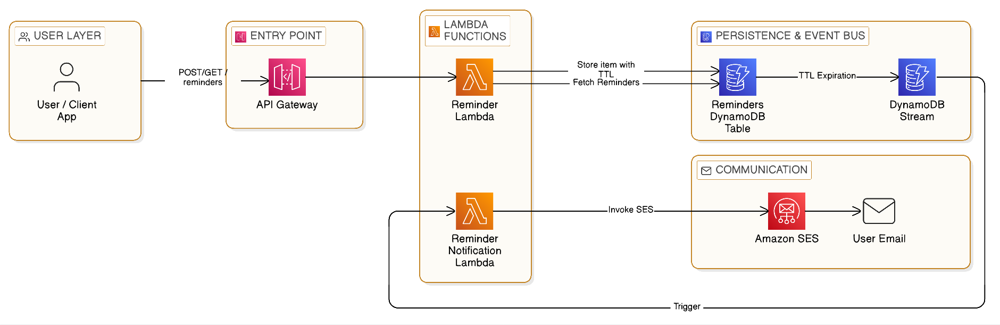

# Reminder App


> "What if your database could send emails?" — That's basically what this app does.

A fully serverless, event-driven reminder service built on AWS. You hit an API, set a time, and walk away. When the moment arrives, an email lands in your inbox — no polling, no cron jobs, no always-on servers burning money in the background.

---

## The Interesting Part — How It Actually Works

Most reminder apps run a background job that wakes up every minute, scans a database, and asks *"is it time yet?"* — That's wasteful and boring.

This app does something more elegant: it uses **DynamoDB's TTL feature as a native countdown timer**.

When you create a reminder, the scheduled time is stored as the item's TTL. When that timestamp hits, DynamoDB automatically deletes the record and fires a `REMOVE` event to a stream. A Lambda function picks that up and sends the email. No scheduler. No polling. AWS does the heavy lifting.



**Flow:**
1. Client hits `POST /reminders` → API Gateway → Reminder Lambda stores item in DynamoDB with `reminderAt` as TTL
2. When TTL expires, DynamoDB fires a `REMOVE` event to the Stream
3. Stream triggers Reminder Notification Lambda → sends email via Amazon SES

---

## Features

- Schedule reminders with a custom message and delivery time
- Email delivery triggered by DynamoDB TTL expiry — zero polling
- Event-driven pipeline via DynamoDB Streams
- REST API (POST + GET) via API Gateway
- Auto-deploy to AWS on every push via GitHub Actions CI/CD
- Full Infrastructure as Code — entire stack in a single `serverless.yml`
- Type-safe AWS SDK with `mypy-boto3` stubs
- Structured observability with AWS Lambda Powertools
- Unit-tested Lambda handlers with mocked AWS clients

---

## Architecture

### Why these choices?

| Concern | Decision | Why it's the right call |
|---|---|---|
| Notification trigger | DynamoDB TTL + Streams | AWS manages the timer — no scheduler process to maintain |
| Compute | AWS Lambda | Costs nothing when idle; scales instantly on demand |
| Storage | DynamoDB (PAY_PER_REQUEST) | No capacity planning; handles spiky workloads naturally |
| Email | Amazon SES | Battle-tested transactional email at fractions of a cent per message |
| Deployment | Serverless Framework IaC | One command deploys the entire stack; fully version-controlled |
| CI/CD | GitHub Actions | Auto-deploys on push to `master`; secrets managed via GitHub |

---

## CI/CD Pipeline

Every push to `master` automatically deploys the full stack to AWS via GitHub Actions.

Pipeline config: [`.github/workflows/deploy.yml`](.github/workflows/deploy.yml)

**What the pipeline does:**
1. Checks out the code
2. Sets up Node.js and installs Serverless Framework
3. Configures AWS credentials from GitHub Secrets
4. Runs `serverless deploy` targeting `backend/serverless.yml`

**Required GitHub Secrets:**

| Secret | Description |
|---|---|
| `AWS_ACCESS_KEY_ID` | IAM user access key with deploy permissions |
| `AWS_SECRET_ACCESS_KEY` | Corresponding secret key |
| `SERVERLESS_ACCESS_KEY` | Serverless Framework dashboard token |
| `SENDER_EMAIL_ID` | Verified SES sender email address |

No credentials are hardcoded — all sensitive values flow through GitHub Secrets at deploy time.

---

## Technical Highlights

**TTL as a timer** — `reminderAt` is stored as a Unix timestamp and set as the DynamoDB TTL attribute. When it expires, DynamoDB fires a `REMOVE` stream event with the full `OldImage` — giving the notification Lambda everything it needs without any extra lookups.

**Type-safe AWS clients** — All DynamoDB and SES calls use `mypy-boto3` stubs, giving full IDE autocompletion and static type checking on AWS SDK responses. Catches mistyped field names at development time, not runtime.

**Lambda Powertools** — Uses `APIGatewayRestResolver` for clean route handling and `@event_source(data_class=DynamoDBStreamEvent)` for typed stream event parsing, cutting boilerplate and adding structured logging out of the box.

**IST → UTC conversion** — The API accepts times in IST (`+05:30`) and converts to UTC before storing as a Unix timestamp, ensuring correct TTL behaviour regardless of the Lambda's execution region.

**Zero-touch infrastructure** — The DynamoDB table, Streams config, Lambda functions, API Gateway routes, and IAM role are all defined in `serverless.yml`. A new environment is one command away.

---

## Technologies Used

| Layer | Technology |
|---|---|
| Runtime | Python 3.14 |
| Compute | AWS Lambda |
| API | Amazon API Gateway (REST) |
| Database | Amazon DynamoDB (PAY_PER_REQUEST, TTL, Streams) |
| Email | Amazon SES |
| Framework | Serverless Framework v4 |
| AWS SDK | boto3 1.42 + mypy-boto3 (type-safe stubs) |
| Observability | AWS Lambda Powertools 3.24 |
| CI/CD | GitHub Actions |
| Testing | pytest + unittest.mock |

---

## API Reference

### POST /reminders — Create a reminder

| Field | Type | Required | Description |
|---|---|---|---|
| `userId` | string | yes | Recipient email address |
| `message` | string | yes | Reminder message body |
| `reminderAt` | string | yes | Scheduled time in IST — format: `YYYY-MM-DD HH:MM:SS` |

```bash
curl -X POST https://<api-id>.execute-api.us-east-1.amazonaws.com/dev/reminders \
  -H "Content-Type: application/json" \
  -d '{
    "userId": "user@example.com",
    "message": "Time to take your medication!",
    "reminderAt": "2026-04-10 09:00:00"
  }'
```

```json
{
  "message": "reminder successfully created",
  "response": { "ResponseMetadata": { "HTTPStatusCode": 200 } }
}
```

### GET /reminders — List all reminders

```bash
curl https://<api-id>.execute-api.us-east-1.amazonaws.com/dev/reminders
```

```json
{
  "message": "Reminders data fetched successfully",
  "response": {
    "Items": [
      {
        "reminderId": { "S": "uuid" },
        "userId": { "S": "user@example.com" },
        "message": { "S": "Take medication" },
        "reminderAt": { "N": "1744261800" },
        "createdAt": { "N": "1744175400" }
      }
    ]
  }
}
```

---

## Prerequisites

- [Python 3.12+](https://www.python.org/downloads/)
- [Node.js](https://nodejs.org/) (required by Serverless Framework CLI)
- [Serverless Framework v4](https://www.serverless.com/framework/docs/getting-started)
- AWS account with credentials configured (`aws configure`)
- A verified sender email in [Amazon SES](https://docs.aws.amazon.com/ses/latest/dg/verify-addresses-and-domains.html)

---

## Installation & Deployment

1. Clone the repository:
   ```bash
   git clone https://github.com/your-username/reminder-app.git
   cd reminder-app
   ```

2. Install Python dependencies:
   ```bash
   pip install -r requirements.txt
   ```

3. Install Serverless Framework:
   ```bash
   npm install -g serverless
   ```

4. Set your verified SES sender email in `backend/serverless.yml`:
   ```yaml
   environment:
     SENDER_EMAIL_ID: your-verified-email@example.com
   ```

5. Deploy:
   ```bash
   cd backend
   serverless deploy
   ```

### Tear Down

To remove all AWS resources created by this project:

```bash
cd backend
serverless remove
```

This deletes the Lambda functions, API Gateway, DynamoDB table, and IAM role — leaving no orphaned resources in your AWS account.

---

## Running Tests

```bash
cd backend
pytest
```

Lambda handlers are tested in isolation — DynamoDB and SES clients are patched with `unittest.mock`, so no real AWS calls are made during testing.

---

## Project Structure

```
reminder-app/
├── .github/
│   └── workflows/
│       └── deploy.yml           # GitHub Actions CI/CD pipeline
├── backend/
│   ├── createReminder.py        # Lambda: POST /reminders, GET /reminders
│   ├── reminderNotification.py  # Lambda: DynamoDB Stream → SES email
│   ├── Utils.py                 # Shared AWS clients and response helpers
│   ├── serverless.yml           # IaC: Lambda, DynamoDB, API Gateway, IAM
│   └── tests/
│       ├── test_create_reminder.py
│       ├── test_list_reminders.py
│       └── test_reminder_notification.py
├── requirements.txt
└── README.md
```

---

## Skills Demonstrated

- **Event-driven architecture** — DynamoDB TTL + Streams as a serverless scheduling mechanism
- **Serverless design** — zero idle cost, scales automatically with demand
- **AWS service integration** — Lambda, API Gateway, DynamoDB, SES connected end-to-end
- **CI/CD** — automated deployment pipeline with GitHub Actions and secrets management
- **Infrastructure as Code** — full stack defined and deployed via Serverless Framework
- **Type safety in Python** — mypy-boto3 stubs for compile-time AWS SDK validation
- **Testing** — isolated unit tests with mocked AWS clients

---

## License

This project is licensed under the [MIT License](https://opensource.org/licenses/MIT).
